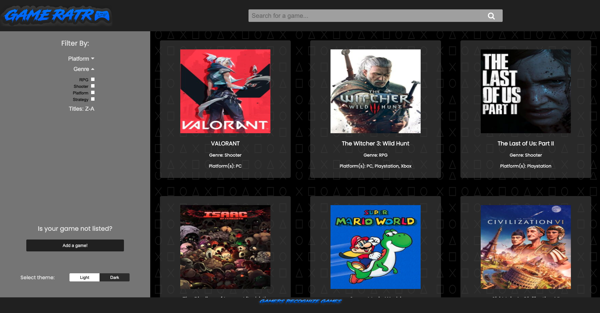

# GameRatr
## What is GameRatr?
GameRatr is an app that allows you to scroll through a catalog of video games. You have the ability to filter the results, search for a specific game, or add a game if you can't find the one you're looking for.
## How was GameRatr created?
GameRatr is a Full-Stack Application that uses Node.js and Express.js for the server. All games are saved in a database using MySQL, and using sequelize to run queries against that database.
## What were some challenges when creating GameRatr?
The goal of this project was to make a Full-Stack Application using everything that I know. Using sequelize provides many challenges such as sequelize commands that don't directly translate to SQL queries. The most frustrating challenge during this project was building a filter feature from scratch rather than importing one that works already.
## Sounds great! How do I use this app?
All you have to do is visit <a href="https://eclipse.thelaclair.com" target="_blank">Eclipse</a>. If you would like to run this application or make changes locally,
clone the repository and run npm install and you are all set!
## Screenshot

